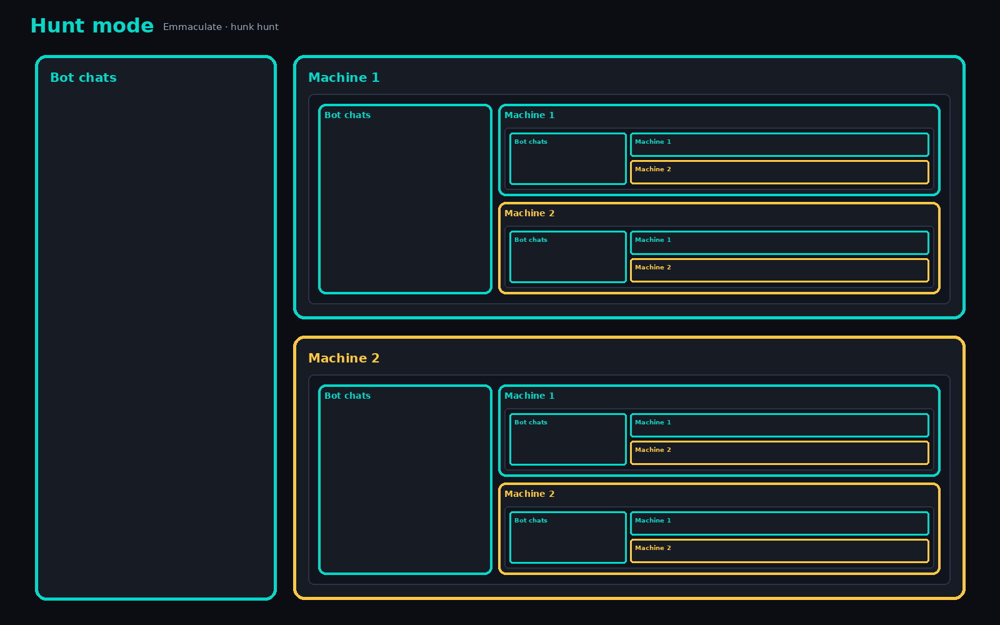
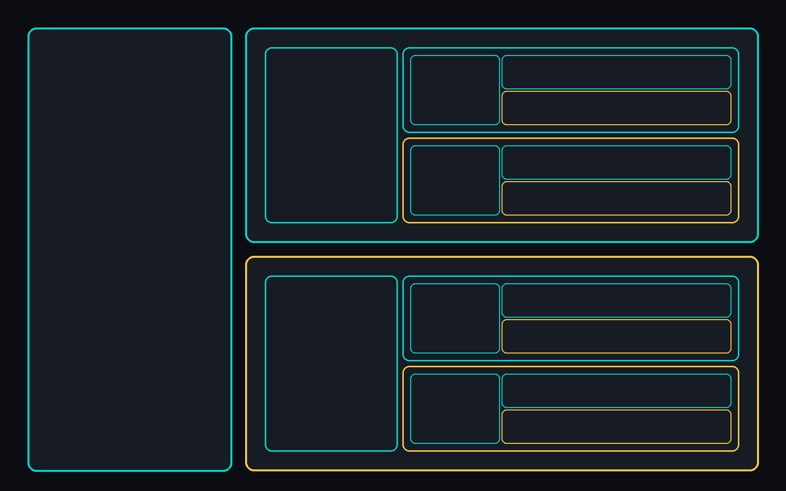

# Emmaculate UX - Hunt mode (hunk hunt)

**Working name:** Emmaculate / Hunt / hunk hunt (same idea)\
**Community proposal:** `surfthewave-commits`\
**Product home:** **Boss Console** - there is a reason it is called a *console*.

> **Status: community design proposal, pending maintainer acceptance.** This document
> describes a possible UX, not shipped Hunt functionality or an approved roadmap.
> Machine 1 / Machine 2, nested shared sessions, model/world integrations, and GPU
> portability below are design goals, not current compatibility guarantees.

## Why “Boss Console”

Boss is not another brain and not another world model. It is the **operator console**:
the hangar where human and agent sit as a pair, pass the same world, and govern tools.

- **Grok Bot (today)** may not recall Astra, Atlas, or a particular LLM - and that is fine.
- **Boss Hunt UX** welcomes **all** of them as modular seats: any agent, any world, any GPU era.
- The console stays; guests plug in. **No lock-in on any node** is exactly how you get
  **infinite lock-in on Boss** - the sticky layer is the grammar, not the vendor.

Vanilla mass (Apple-smooth defaults) and radical hackability (Android/Linux stems) should
**fork from the same console core**, not from locked brains.

## One-liner

**Hunt mode** = Emmaculate fractal UX for a **human–agent pair**.\
**Hunk hunt** = the nestable unit *and* the chain (hunk ≡ hunt here).

Progress-shaped: modalities are fuel. The product moves the pair from **problem space**
(pain, stuck) to **progress space** (pain removed or possibility sharp enough to want
tomorrow). Score every pass by whether pain fell or possibility rose.

## Token spine (unchanging)

```text
text/world/tool-result → TOKENIZE → IDs → EMBED → TRANSFORMER (+ weights, KV)
  → next token → … → DETOKENIZE → text
```

Information ≈ energy: every move costs compute, KV, attention, money.\
Tokens are not exotic magic - they transform into/out of the spine; side effects
re-enter as tokens. Adoption wraps the stream; it does not replace it.

## Grammar (not infinite runtime)

You do not need infinite runtime to create universes. You need a **grammar**:

```text
pair → stream in (boss) → world (Fluck / twin / Atlas-class)
  → pass (rally | surrender | domination) → brake → nest? → exit
```

**Infinite as type** (hunk hunt inside hunk hunt). **Finite as run** (tokens, attention, bill).

### Universe types

| Type | Shape |
|------|--------|
| Solo | one seat dominates |
| Pair | grey hunt, rally passes (default) |
| Nest | hunk → hunk fractal |
| Braid | parallel hunks across seats |
| Brake-bound | any + hard stop (OTP, pay, kill-switch) |
| Parked | sleeps until next token |
| Spatial (Atlas-class) | world/sim as the stage |
| Agentic (Astra-class) | deep computer-use domination stretches |

Atlas expands the **world** link; Astra-class models expand the **agent seat** link.
Neither abolishes brakes or the pair.

## Seat slider

```text
FULL HUMAN ──────── GREY HUNT ──────── FULL AGENT
                      (reality)
```

Full human / full agent are ideals; **grey hunt is the product**.\
Passing is key: **rally** (volley), **surrender** (yield), **domination** (one seat holds -
bounded by brakes). Design for handoffs that may drop (GitHub OTP mornings).

**Fluck** = the pass made visible (shared browser dance).

## Fractal test

At every nest: same chrome, spine, slider, pass dance, brakes, omit–commission.\
**Pass:** forget which nest you are in - you can still hunt.\
**Fail:** foreign app, hidden brakes, or nowhere to show the pass.

## Modular max / no node lock-in

| Node | Must stay swappable |
|------|---------------------|
| Model / agent CLI | Codex, Claude, Gemini, OpenCode, Astra-class, … |
| World | Fluck pages, Arcade, Atlas-class spatial, mocks |
| GPU / datacenter | workloads move across NVIDIA gens and vendors without rewriting Hunt |
| Outer mouth | Bot chats (any harness) - optional clothing |

**Commission:** shared stream, Fluck-visible pass, kill-switches, Tool Creator hack surface.\
**Omit:** vendor-only skins that hide governance; dock chaos; blind full-auto without surrender.

Apple-smooth **vanilla** profile + Linux-hackable **power** profile = same console, two stems.

## GPU / era portability

Hunt must not be GPU-constrained as a *product identity*. Weights and KV migrate across
silicon eras and companies; the console grammar stays. (Training/inference packaging
changes; hunk hunt links do not.)

## Proposed interaction

**One-liner:** Home Boss copies you for the agent. Same home nests in both.

**Seats** (same names at every nest):

1. **Bot chats** - input mouth / harness
2. **Machine 1** - agents run this boss, pair work ready
3. **Machine 2** - for me - solo boss instance (current Boss version)

**Call Boss** only when the task is complex and needs parallelisation (State 0 stays single-stream; dim Machine 1 until then). Nest mouths are local. Same Boss follows home (not “chrome only”). Always expose exit / brake.

Also:

1. Attach strongest available agent as Astra-stand-in into Machine 1.
2. Fluck (+ Arcade mocks) as Atlas-stand-in until spatial world APIs land.
3. Kill-switches stay on the human side (Bot chats / Machine 2).

## Ask of maintainers

- Accept **Hunt / Emmaculate** as north-star language (or rename; keep the console thesis).
- Signal v0: seat badge + shared session id + docs, vs deeper Operator panel.
- Confirm modular BYO agent/world remains sacred (reason it is Boss *Console*).
- Maintainers may decline; dogfood PRs welcome (#380 / #382 lineage).

## Related

- Agent-less MCP kill-switch discoverability: [issue #380](https://github.com/risa-labs-inc/BossConsole/issues/380) / [PR #382](https://github.com/risa-labs-inc/BossConsole/pull/382).
  That work concerns navigation to existing tool controls; it does not implement Hunt mode.
- Token spine teaching: adoption wraps the stream

## Visual

Concept diagrams, not application screenshots. Each nest repeats Bot chats on the
left, Machine 1 at the upper right (teal), and Machine 2 at the lower right
(amber). The text-free version repeats that structure without seat labels.

Labeled Depth (Hunt mode seats):



Structure only (no text):



The [earlier grammar poster](ha-hunt-visual-flow.svg) illustrates the token spine
and pass vocabulary. It is a separate concept illustration, not the editable
source of the Depth PNGs above.
