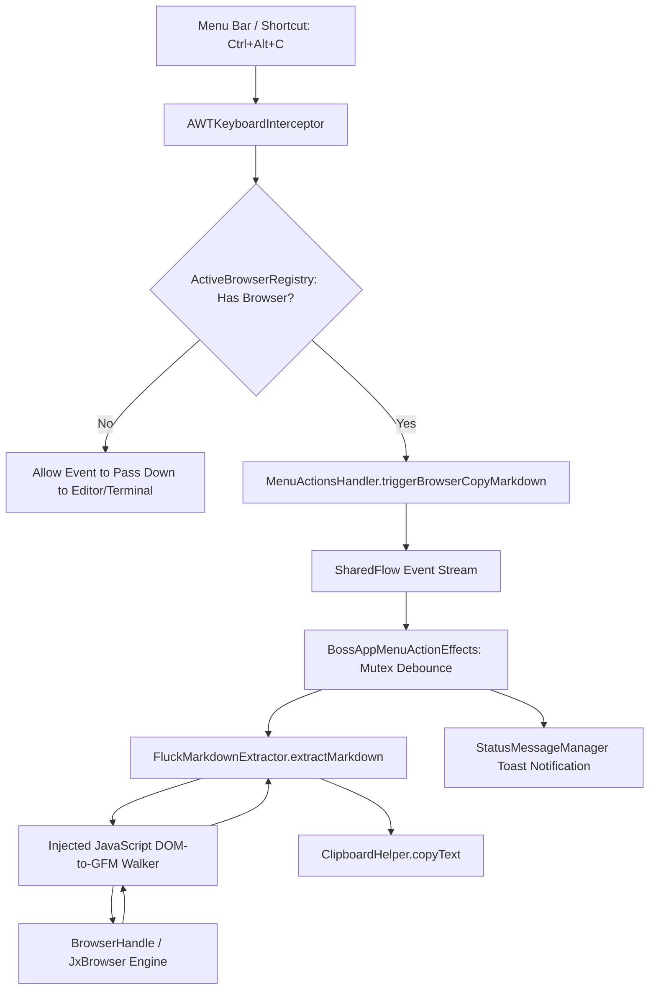

# Fluck Browser: Copy as Markdown for Agent

A developer feature in **Fluck Browser** designed as an **Agent Context Bridge**: it extracts web pages or highlighted selections directly into clean, token-efficient **GitHub Flavored Markdown (GFM)** with source citations, formatted specifically for consumption by AI agents and LLMs.

---

## 1. Feature Overview & Usage

### Key Capabilities
* **Smart Selection Extraction & Indentation Preservation**: When text or code is highlighted on a webpage, it preserves the DOM hierarchy and preformatted indentation within the selection. Interior code snippets retain their spaces, tabs, and line breaks without getting flattened into single-line strings.
* **Full-Page Article Fallback**: When nothing is selected, it scans for main content containers (`<article>`, `<main>`, `[role="main"]`, or `<body>`), stripping away noise like navigation bars, footers, headers, ads, SVGs, and code-block line numbers.
* **Shadow DOM (Web Components) Traversal**: Penetrates open `#shadow-root` trees on custom elements (e.g., `<api-parameter-table>`, Shoelace, Swagger UI, Lit components) so web component content is never dropped as empty tags.
* **Screen-Reader & CSS-Hidden Text Pruning**: Filters out `[hidden]`, `[aria-hidden="true"]`, `.sr-only`, `.visually-hidden`, `.screen-reader-text`, `.hidden`, `.d-none`, `.invisible`, and inline `display: none` styles. Avoids the detached clone `getComputedStyle` trap by checking live element connectivity before computing styles.
* **GitHub PR & Issue Diff Conversion**: Detects GitHub diff tables (`.diff-table`) and serializes `.blob-code` lines directly into clean, unified ````diff` code blocks rather than broken pipe tables with split line numbers.
* **Technical Math (KaTeX & MathJax) Preservation**: Detects KaTeX and MathJax formula containers, identifying display wrappers (`.katex-display`, `.MathJax_Display`) vs inline formulas, and extracting raw LaTeX annotations (`<annotation encoding="application/x-tex">` or `data-latex`) into clean inline (`$ ... $`) or block (`$$ ... $$`) math without visual HTML span soup duplicates.
* **Token Protection against Base64 Data URIs**: Stubs inline `data:image/...` URIs into ``, preventing tens of thousands of uncompressible base64 characters from blowing up the agent's context window.
* **Markdown & Indirect Prompt Injection Hardening**: Sanitizes `document.title` by stripping newlines, escaping markdown brackets (`[` and `]`), and limiting length to 200 characters, preventing malicious page titles from breaking out of the citation blockquote or executing prompt injection attacks.
* **Nested List & Table Integrity**:
  * Formats multi-level lists with hierarchical indentation (`  - `, `    - `).
  * Direct-scope row cells (`:scope > th, :scope > td`) prevent nested sub-tables from corrupting outer columns, and embedded newlines inside cells are sanitized to keep Markdown table rows intact.
* **Documentation Admonitions / Callouts**: Automatically recognizes callouts from Docusaurus, VitePress, Mintlify, and GitHub (`.admonition`, `.markdown-alert`, `.callout`) and translates them to GFM blockquote alerts (`> [!NOTE]` and `> [!WARNING]`).
* **Cross-Origin iFrame Support**: Falls back to `document.activeElement.contentWindow.getSelection()` when focus is inside embedded documentation playgrounds or code sandboxes.
* **Prose Angle Bracket Escaping**: Escapes bare HTML-like opening tags in prose (e.g. `std::vector<int>` or `<div class="...">`) to `\<` (CommonMark backslash escaping rather than raw HTML entities `&lt;`) so downstream LLM tokenizers and parsers read clean code without entity confusion.
* **Parentheses in URLs Link Protection**: Wraps URLs containing parentheses in angle brackets (e.g. `[Closure](<https://en.wikipedia.org/wiki/Closure_(computer_programming)>)`) in both markdown body links and the source citation header, preventing CommonMark parsers from prematurely breaking the URL link destination.
* **European Keyboard `AltGr + C` Protection**: Checks `!event.isAltGraphDown` in `AWTKeyboardInterceptor`, ensuring that European keyboard layouts (e.g. Polish typing `ć` or international layouts typing `©`) are never hijacked as `Ctrl + Alt + C`.
* **Code-Block "Copy" Button Noise Filtering**: Prunes interactive copy buttons (`.copyButton`, `.copy-button`, `.clean-btn`, `button`, `[role="button"]`), preventing the literal word `"Copy"` or `"Copied!"` from contaminating extracted markdown code blocks.
* **Admonition Title Deduplication**: Automatically filters `.admonition-title`, `.admonition-heading`, and `.markdown-alert-title` elements that merely repeat the alert name, eliminating redundant lines like `> [!TIP]\n> Tip`.
* **Dynamic Backtick Run Calculations**:
  * Inline code containing backticks is wrapped in $N+1$ backticks padded with spaces (e.g. ```` `` `test` `` ````).
  * Code blocks containing triple backticks (e.g. tutorials demonstrating Markdown fences) dynamically scale their outer fences to $N+1$ backticks (e.g. ```` ````markdown ````).
* **Main World Prototype Poisoning & Safe JSON Fallback**: Caches clean array and string primitives (`_ArrayFrom`, `_JSONStringify`) from closure scope and provides a localized fallback serializer (`safeJson`) in case page scripts or hostile polyfills tamper with standard JS prototypes.
* **Semantic Structural HTML Tags**:
  * Strikethrough: `<del>`, `<s>`, and `<strike>` convert to GFM `~~text~~`.
  * Horizontal Rules: `<hr>` converts to `---`.
  * Definition Lists: `<dl>`, `<dt>`, and `<dd>` format terms into bold `**term**: ` and descriptions into indented text.
  * Task List Checkboxes: Inspects `checkbox.checked` on list items and prepends `[x] ` or `[ ] `.
* **Whitespace-Only Line Regex Cleanup**: Strips trailing whitespace lines (`/[ \t]+$/gm`) before collapsing multiple newlines, preventing stranded spaces from tricking CommonMark parsers into interpreting subsequent paragraphs as indented code blocks.
* **Modal Dialog Focus Isolation**: Verifies that no modal dialog is active (`!isModalDialogOpen()`) and that focus is inside a browser component before consuming the shortcut.
* **Linux Wayland / X11 Selection Loss Prevention**: Writes clipboard content to both `systemClipboard` and `systemSelection` (the X11 primary selection buffer) on Linux, ensuring clipboard data survives when the application blurs.
* **Automatic Citation Header**: Prepends prompt-engineered source metadata to ground AI responses:
  ```markdown
  > **Source:** [Kotlin Language](https://kotlinlang.org/)
  > **Captured from Fluck Browser**

  ## Features
  - Concise syntax
  - Multiplatform support
  ```
* **Status Bar Toast & Blended Token Estimation**: Displays a non-blocking toast in the status bar with token estimates calculated via a blended heuristic (~3.2 chars/token for code/tables, ~4.0 chars/token for prose):
  * `Selection Markdown copied for agent (~45 tokens)`
  * `Page Markdown copied for agent (~1,250 tokens)`
* **In-Engine & Clipboard Safety Limits**:
  * V8 In-Engine Short-Circuit: Aborts DOM traversal if accumulated length exceeds 250,000 characters to prevent renderer GC pauses.
  * Kotlin Ceiling: Caps output at 200,000 characters (~50,000 tokens) with a truncation indicator (`> *[Output truncated: exceeded 200,000 character limit]*`).
* **Non-Blocking Clipboard Operations (No Swing EDT Starvation)**: `ClipboardHelper.copyTextSafe` executes on `Dispatchers.IO` with non-blocking coroutine `delay()` retries and atomic UI thread dispatch, preventing Swing EDT thread starvation or Windows cursor freezes on Win32 `OpenClipboard` lock contention.
* **Shortcut Non-Interference**: Checks `ActiveBrowserRegistry.activeIn(windowId) != null` before consuming the shortcut. In non-browser tabs (editor, terminal, settings), the keystroke passes through unhindered.
* **Concurrent Debounce**: A coroutine `Mutex` drops duplicate rapid shortcut hammering so stacked toasts do not flash in the status bar.

---

### How to Use

| Trigger | Shortcut / Action | Scope |
| :--- | :--- | :--- |
| **Keyboard Shortcut (Windows/Linux)** | <kbd>Ctrl</kbd> + <kbd>Alt</kbd> + <kbd>C</kbd> | Active Fluck Browser tab |
| **Keyboard Shortcut (macOS)** | <kbd>Cmd</kbd> + <kbd>Option</kbd> + <kbd>C</kbd> | Active Fluck Browser tab |
| **Edit Menu** | **Edit** → **Copy as Markdown for Agent** | Active Fluck Browser tab |
| **View Menu** | **View** → **Copy as Markdown for Agent** | Active Fluck Browser tab |

---

## 2. Technical Architecture & Implementation

The feature operates across 6 decoupled architectural layers:



### Component Details

#### 1. DOM-to-Markdown Extraction Engine
* **Source File**: `composeApp/src/commonMain/kotlin/ai/rever/boss/browser/FluckMarkdownExtractor.kt`
* Injects a self-contained, vanilla JavaScript DOM walker (`EXTRACTOR_SCRIPT`) into the active Chromium page:
  * Uses `window.getSelection().getRangeAt(0).cloneContents()` when text is selected.
  * Checks `range.commonAncestorContainer` and its ancestors for preformatted style (`pre`, `code`, `white-space: pre*`) to preserve code indentation.
  * Falls back to `document.querySelector('article, main, [role="main"]') || document.body`.
  * Prunes elements matching `noiseSelectors`: `script`, `style`, `nav`, `footer`, `header`, `aside`, `noscript`, `svg`, `canvas`, `dialog`, `[aria-hidden="true"]`, and line numbers (`.line-numbers`, `.gutter`).
  * Enforces `MAX_V8_CHARS = 250000` memory guard during recursive traversal.
  * Resolves absolute URLs from DOM properties (`node.href`, `node.src`).
  * Formats direct-scope table rows (`:scope > th, :scope > td`) and converts cell newlines to spaces.
  * Converts nested lists with depth indentation.
  * Formats documentation callouts into GFM blockquote alerts (`> [!NOTE]` / `> [!WARNING]`).
  * Returns an atomic JSON payload: `{"isSelection": Boolean, "markdown": String}`.

#### 2. Keyboard Interceptor & Shortcut Registration
* **Source Files**: 
  * `composeApp/src/commonMain/kotlin/ai/rever/boss/keymap/model/KeymapActions.kt`
  * `composeApp/src/commonMain/kotlin/ai/rever/boss/keymap/presets/KeymapPresets.kt`
  * `composeApp/src/desktopMain/kotlin/ai/rever/boss/window/AWTKeyboardInterceptor.kt`
* Hooks into Java AWT's global `KeyboardFocusManager`. Verifies `ActiveBrowserRegistry.activeIn(windowId) != null` before consuming the keypress; if the active tab is not a browser, it returns `false` so the event reaches code editors or terminals.

#### 3. Menu Bar Integration
* **Source File**: `composeApp/src/desktopMain/kotlin/ai/rever/boss/window/BossWindow.kt`
* Registers **Copy as Markdown for Agent** in both the **Edit** and **View** menus.
* Dynamically enabled/disabled based on `hasBrowser` (whether the currently active tab hosts an active browser instance).

#### 4. Event Bus & UI Feedback
* **Source Files**: 
  * `composeApp/src/commonMain/kotlin/ai/rever/boss/window/MenuActionsHandler.kt`
  * `composeApp/src/commonMain/kotlin/ai/rever/boss/app/BossAppMenuActionEffects.kt`
* `MenuActionsHandler.browserCopyMarkdownEvents` emits the target `windowId` over a `SharedFlow`.
* A coroutine `Mutex` guards the collector against rapid keypress spamming.
* Retrieves the active browser handle, executes extraction on `Dispatchers.Default`, copies to clipboard via `ClipboardHelper`, and displays a toast with blended token estimates on `Dispatchers.Main`.

#### 5. Headless Unit Test Suite
* **Source File**: `composeApp/src/desktopTest/kotlin/ai/rever/boss/browser/FluckMarkdownExtractorTest.kt`
* Implements `FakeBrowserHandle` to execute tests without requiring live Chromium binaries or commercial JxBrowser license keys.
* Validates preformatted indentation, table direct scoping, iframe fallback, V8 memory guard, admonitions, angle bracket escaping, token density, and size limits.

---

## 3. Verification & Testing

### Automated Test Command
Run the test suite verifying all behaviors and edge cases:
```bash
./gradlew :composeApp:desktopTest --tests "*FluckMarkdownExtractorTest*" --console=plain
```

### Manual Verification Steps (Requires JxBrowser License)
1. Ensure `jxbrowser.license.key=YOUR_KEY` is present in `local.properties`.
2. Run the desktop application:
   ```bash
   ./gradlew :composeApp:run
   ```
3. Open a browser tab (<kbd>Ctrl</kbd> + <kbd>T</kbd> → **Browser**).
4. Navigate to any documentation page (e.g. `https://kotlinlang.org`).
5. **Selection Test**: Highlight a block of indented code and press <kbd>Ctrl</kbd> + <kbd>Alt</kbd> + <kbd>C</kbd>. Verify the status bar toast shows `Selection Markdown copied...`, then paste (<kbd>Ctrl</kbd> + <kbd>V</kbd>) into an editor to confirm indentation and backticks are preserved.
6. **Full-Page Test**: Click to deselect all text and press <kbd>Ctrl</kbd> + <kbd>Alt</kbd> + <kbd>C</kbd>. Verify the status bar toast shows `Page Markdown copied...`, then paste to confirm header citations, admonition alerts, and clean GFM.
7. **Editor Passthrough Test**: Switch to a code editor or terminal tab. Press <kbd>Ctrl</kbd> + <kbd>Alt</kbd> + <kbd>C</kbd> and verify the keystroke is not hijacked.
