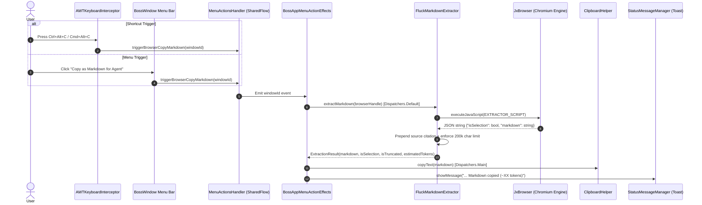

# Fluck Browser: Copy as Markdown for Agent - Technical Implementation Specification

This document provides an exhaustive technical breakdown of the **"Copy as Markdown for Agent"** implementation in Fluck Browser within the BOSS desktop application.

---

## 1. Architectural Overview & Data Flow

When a user triggers the command via keyboard shortcut (<kbd>Ctrl</kbd>+<kbd>Alt</kbd>+<kbd>C</kbd> / <kbd>Cmd</kbd>+<kbd>Option</kbd>+<kbd>C</kbd>) or via the application menu bar, the request flows through five distinct subsystems:



---

## 2. File-by-File Technical Breakdown

| File Path | Role in Feature |
| :--- | :--- |
| `composeApp/src/commonMain/kotlin/ai/rever/boss/browser/FluckMarkdownExtractor.kt` | Core engine: Injected JS DOM walker, JSON decoding, metadata citations, safety caps |
| `composeApp/src/desktopMain/kotlin/ai/rever/boss/window/AWTKeyboardInterceptor.kt` | Global AWT keyboard event listener intercepting `Ctrl+Alt+C` before Chromium consumes it |
| `composeApp/src/commonMain/kotlin/ai/rever/boss/keymap/model/KeymapActions.kt` | Action identifier `BROWSER_COPY_MARKDOWN = "browser.copy_markdown"` and category mappings |
| `composeApp/src/commonMain/kotlin/ai/rever/boss/keymap/presets/KeymapPresets.kt` | Default keybinding registration (`Cmd/Ctrl` + `Alt` + `C`) |
| `composeApp/src/commonMain/kotlin/ai/rever/boss/window/MenuActionsHandler.kt` | Coroutine event bus (`_browserCopyMarkdownEvents: MutableSharedFlow<String>`) |
| `composeApp/src/desktopMain/kotlin/ai/rever/boss/window/BossWindow.kt` | Native desktop window menu bar integration under **Edit** and **View** |
| `composeApp/src/commonMain/kotlin/ai/rever/boss/app/BossAppMenuActionEffects.kt` | Asynchronous effect coordinator handling extraction, clipboard write, and toast |
| `composeApp/src/desktopTest/kotlin/ai/rever/boss/browser/FluckMarkdownExtractorTest.kt` | Headless unit test suite with `FakeBrowserHandle` |

---

## 3. Deep Dive: The Extraction Algorithm

The core extraction logic resides in `FluckMarkdownExtractor.kt`.

### 3.1 JavaScript DOM-to-GFM Walker (`EXTRACTOR_SCRIPT`)
Because web documents are complex trees with dynamic styling, extraction is executed directly inside Chromium's JavaScript runtime:

1. **Selection Detection with Cross-Origin iFrame Fallback**:
   ```javascript
   let selection = window.getSelection();
   if ((!selection || selection.rangeCount === 0 || selection.isCollapsed) && 
       document.activeElement && document.activeElement.tagName === 'IFRAME') {
     try {
       const iframeSel = document.activeElement.contentWindow?.getSelection();
       if (iframeSel && iframeSel.rangeCount > 0 && !iframeSel.isCollapsed) {
         selection = iframeSel;
       }
     } catch (e) {
       // Cross-origin iframe security restriction - ignore gracefully
     }
   }
   ```
   When the user is focused inside an interactive playground, sandbox, or documentation iframe, `document.activeElement.contentWindow.getSelection()` retrieves the highlighted text.

2. **Preformatted Ancestor Detection**:
   If text is highlighted inside a function or pre block, `range.cloneContents()` only grabs the interior `<code>`, `<span>`, or text nodes without the parent `<pre>`. To prevent indentation destruction:
   ```javascript
   let common = range.commonAncestorContainer;
   if (common && common.nodeType === Node.TEXT_NODE) common = common.parentNode;
   if (common && common.closest) {
     const preEl = common.closest('pre, code');
     const ws = window.getComputedStyle ? window.getComputedStyle(common).whiteSpace : '';
     if (preEl || (ws && ws.startsWith('pre'))) {
       selectionWasPreformatted = true;
     }
   }
   ```

3. **Article / Semantic Root Fallback**:
   When no text is selected, the script searches for the primary semantic content container:
   ```javascript
   const candidate = document.querySelector('article') 
       || document.querySelector('main') 
       || document.querySelector('[role="main"]') 
       || document.body;
   root = candidate ? candidate.cloneNode(true) : null;
   ```

4. **Noise Pruning**:
   Non-content elements, boilerplate navigation, accessibility-hidden structures, and gutter line numbers are removed prior to traversal:
   ```javascript
   const noiseSelectors = [
       'script', 'style', 'nav', 'footer', 'header', 'aside', 
       'noscript', 'svg', 'canvas', 'dialog', '[aria-hidden="true"]',
       '.line-numbers', '.line-number', '.linenumber', '.gutter'
   ];
   root.querySelectorAll?.(noiseSelectors.join(',')).forEach(el => el.remove());
   ```

5. **In-Engine Memory Guard (`MAX_V8_CHARS = 250000`)**:
   Recursive traversal tracks `accumulatedChars` and aborts traversal if it exceeds 250,000 characters, preventing runaway GC pauses in Chromium's V8 engine on multi-megabyte pages.

6. **Recursive Node Walking (`walk(node, depth, isPre)`)**:
   A recursive walker converts HTML elements into GFM:
   * **Text Nodes**:
     * If `isPre` is true: Preserves exact whitespace, indentation, and newlines.
     * If `isPre` is false: Collapses whitespace (`\s+` to `' '`) and escapes bare HTML angle brackets in prose (`<(?=[a-zA-Z/!?])` to `&lt;`) so LLMs and parsers do not confuse them with invalid HTML tags.
   * **Headings (`h1`–`h6`)**: Emits corresponding `#` prefix with enclosing newlines.
   * **Code Blocks (`pre`, `code`)**:
     * Preserves exact whitespace (`innerText` / `textContent`).
     * Inspects `className` (e.g., `language-kotlin`, `language-python`) to inject appropriate syntax tags into triple backticks:
       ````javascript
       return '\n```' + lang + '\n' + codeText + '\n```\n';
       ````
   * **Nested Lists (`ul`, `ol`, `li`)**: Passes `depth` down the recursion tree. List items prefix nested items with hierarchical indentation:
     ```javascript
     const indentStr = '  '.repeat(Math.max(0, depth - 1));
     const prefix = isOrdered ? '1. ' : '- ';
     return '\n' + indentStr + prefix + children.trim();
     ```
   * **Nested-Safe Tables (`table`)**:
     * Uses direct child selectors (`:scope > th, :scope > td`) so sub-tables do not corrupt the outer table columns.
     * Sanitizes internal cell newlines (`\r?\n+` to `' '`) to prevent premature GFM table row termination.
     * Escapes pipe characters (`|` to `\|`).
   * **Admonitions & Callouts (`div`, `aside`, `section`)**: Detects documentation alert classes (`.admonition`, `.markdown-alert`, `.callout`) and translates them to GFM blockquote alerts (`> [!NOTE]` or `> [!WARNING]`).
   * **Links (`a`) & Images (`img`)**: Resolves fully qualified URLs via DOM properties (`node.href`, `node.src`).

7. **JSON Envelope Return**:
   ```json
   {
       "isSelection": true,
       "markdown": "..."
   }
   ```

---

### 3.2 Kotlin Extraction Pipeline & Safety Limits

In `FluckMarkdownExtractor.extractMarkdown(browserHandle)`:

1. **Execution & Parsing**:
   * Calls `browserHandle.executeJavaScript(EXTRACTOR_SCRIPT)`.
   * Decodes the JSON envelope with `kotlinx.serialization`.

2. **Size Capping (Guard against Runaway Allocation)**:
   * Imposes `MAX_MARKDOWN_CHARS = 200_000` (approximately 50,000 tokens):
   ```kotlin
   val isTruncated = rawBody.length > MAX_MARKDOWN_CHARS
   val boundedBody = if (isTruncated) {
       rawBody.substring(0, MAX_MARKDOWN_CHARS) + 
           "\n\n> *[Output truncated: exceeded 200,000 character limit]*"
   } else {
       rawBody
   }
   ```

3. **Source Citation Prepending**:
   Injects standardized prompt-engineering metadata at the top:
   ```kotlin
   buildString {
       if (pageTitle.isNotBlank() || pageUrl.isNotBlank()) {
           val displayTitle = if (pageTitle.isNotBlank()) pageTitle else pageUrl
           appendLine("> **Source:** [$displayTitle]($pageUrl)")
           appendLine("> **Captured from Fluck Browser**")
           appendLine()
       }
       append(boundedBody)
   }
   ```

4. **Blended Token Estimation**:
   Uses an adaptive BPE density heuristic:
   ```kotlin
   val isCodeOrTable = boundedBody.contains("```") || boundedBody.contains("| --- |")
   val estimatedTokens = if (isCodeOrTable) {
       ((finalPayload.length * 10) / 32).coerceAtLeast(1) // ~3.2 chars/token
   } else {
       ((finalPayload.length + 3) / 4).coerceAtLeast(1)  // ~4.0 chars/token
   }
   ```

---

## 4. Keystroke Interception Architecture & Non-Interference

A critical challenge in Compose Multiplatform desktop apps embedding Chromium (JxBrowser) is that native Chromium windows intercept and consume all keyboard events before the Compose scene receives them.

To solve this, `AWTKeyboardInterceptor.kt` hooks into Java AWT's global `KeyboardFocusManager`. However, **it must not hijack shortcuts in non-browser tabs** (such as code editors, where `Ctrl+Alt+C` is often bound to Copy Reference or Git actions):

```kotlin
// In AWTKeyboardInterceptor.kt
KeymapActions.BROWSER_COPY_MARKDOWN -> {
    if (ActiveBrowserRegistry.activeIn(windowId) != null) {
        MenuActionsHandler.triggerBrowserCopyMarkdown(windowId)
        true // Consumed only when the active tab is a browser!
    } else {
        false // Passed through to editors, terminals, or settings panels
    }
}
```

---

## 5. Coroutine & Threading Model with Mutex Debounce & Non-Blocking Clipboard

All phases of the copy action are isolated on appropriate coroutine dispatchers:

* **Dispatchers.Main**: Listens to the action flow, checks active browser registry, and handles final UI toast displays.
* **Rapid Keypress Debounce**: Uses `copyMarkdownMutex.tryLock()` to immediately drop repeated emissions if an extraction is already in flight, preventing stacked clipboard writes and flashing status toasts.
* **Dispatchers.Default**: Executes the Markdown extraction, JSON deserialization, token estimation, and string building off the main thread, ensuring zero frame drops or UI stutter on large pages.
* **Dispatchers.IO Non-Blocking Clipboard**: `ClipboardHelper.copyTextSafe` executes retries on `Dispatchers.IO` using coroutine `delay()` rather than `Thread.sleep()`. The atomic `systemClipboard.setContents(...)` is dispatched to `Dispatchers.Main` without ever blocking the Swing Event Dispatch Thread (EDT), eliminating UI freezes and cursor stutter on Windows Win32 `OpenClipboard` lock contention.
* **Cancellation Safety**: All coroutines catch `CancellationException` and re-throw, preventing coroutine scope pollution if a tab is closed during extraction.

---

## 6. Testing Strategy

The feature includes headless automated tests in `FluckMarkdownExtractorTest.kt` using `FakeBrowserHandle`:

1. **Selection Priority**: Verifies that active selections take precedence over full-page content.
2. **Preformatted Selection Indentation**: Verifies that highlighted code selections preserve interior spaces, tabs, and newlines.
3. **Table Direct Scoping & Newline Sanitization**: Verifies that `:scope > th, :scope > td` prevents nested sub-table corruption and cell newlines are converted to spaces.
4. **Nested List Indentation**: Verifies that sub-lists receive depth-based indentation (`  - `, `    - `).
5. **Cross-Origin iFrame Fallback**: Asserts fallback to `activeElement.contentWindow.getSelection()`.
6. **CommonMark Backslash Angle Bracket Escaping**: Verifies `<` in prose like `std::vector<int>` is escaped to `\<` (avoiding HTML entities like `&lt;`).
7. **Admonition / Callout Translation**: Verifies `.admonition` and `.markdown-alert` are converted to `> [!NOTE]` and `> [!WARNING]`.
8. **In-Engine Memory Guard**: Asserts early abort at `MAX_V8_CHARS = 250000`.
9. **Blended Token Estimation**: Asserts higher token density for code/tables (~3.2 chars/token) vs prose (~4 chars/token).
10. **Size Bounds & Truncation**: Supplies payloads exceeding 200k characters and asserts truncation notes and length limits.
11. **Base64 Inline Image Stubbing**: Asserts inline `data:image/...` data URIs are stubbed to `[embedded image data omitted]`.
12. **KaTeX & MathJax Formula Preservation**: Asserts detection of `.katex`, `.katex-display`, and `.MathJax` annotations, formatting as `$ ... $` or `$$ ... $$` without `.katex-html` span duplicates.
13. **GitHub Diff Table Formatting**: Asserts `.diff-table` and `.blob-code` cells are formatted into unified ````diff` code blocks.
14. **Shadow DOM (Web Components) Traversal**: Asserts recursive inspection of open `node.shadowRoot`.
15. **Screen-Reader & Hidden Text Pruning**: Asserts filtering of `[hidden]`, `[aria-hidden="true"]`, `.sr-only`, `.visually-hidden`, `.hidden`, `.d-none`, and `.invisible`, avoiding the detached clone `getComputedStyle` trap.
16. **Indirect Prompt Injection & Link Escaping**: Asserts that malicious titles with unescaped markdown links `]` and newlines `\n` are sanitized and escaped in the citation header.
17. **OS-Level Clipboard Locking**: Verifies that `ClipboardHelper.copyTextSafe` handles Windows `IllegalStateException` with bounded retries and non-blocking backoff.

---

## 7. Edge Cases & Hardening Matrix

| # | Edge Case / Bug | Root Cause | Implemented Solution |
| :--- | :--- | :--- | :--- |
| 1 | **Code Indentation Flattened on Selections** | `range.cloneContents()` drops `<pre>` wrapper; text walker collapsed `\s+` to `' '`. | Inspects `range.commonAncestorContainer` for `pre`, `code`, or `white-space: pre*`; preserves raw indentation in `isPre` mode. |
| 2 | **Broken GFM Tables on Newlines & Nested Tables** | `row.querySelectorAll('th, td')` grabbed cells of nested tables; cell `\n` broke GFM rows. | Targeted `:scope > th, :scope > td`; converted cell `\r?\n+` to space and escaped `\|`. |
| 3 | **Flattened Nested Lists** | `children.trim()` captured sub-trees without calculating depth indentation. | Passed `depth` down recursive `walk()` calls and indented items with `'  '.repeat(depth - 1)`. |
| 4 | **Shortcut Hijacking Across Non-Browser Tabs** | `AWTKeyboardInterceptor` consumed `Ctrl+Alt+C` unconditionally. | Added `ActiveBrowserRegistry.activeIn(windowId) != null` check; returns `false` on editor/terminal tabs. |
| 5 | **Selection Blackout in iFrames** | Top-level `window.getSelection()` is collapsed when focus is in an embedded sandbox. | Added fallback to `document.activeElement.contentWindow?.getSelection()`. |
| 6 | **Rapid Shortcut Hammering** | Rapid `Ctrl+Alt+C` presses fired concurrent extractions and stacked toasts. | Protected extraction in `BossAppMenuActionEffects` with a coroutine `Mutex.tryLock()`. |
| 7 | **HTML Entity Decoding Skew in LLMs** | Using `&lt;` caused LLMs to re-emit raw entities in code. | Uses CommonMark backslash escaping `\<` (`replace(/<(?=[a-zA-Z/!?])/g, '\\<')`). |
| 8 | **Token Estimation Skew on Code-Heavy Pages** | Hardcoded `/ 4` underestimated token counts for high-density code and tables. | Applied blended heuristic: `/ 3.2` for code/tables, `/ 4.0` for prose. |
| 9 | **In-Engine Memory Guard for Massive Pages** | Building massive DOM strings inside V8 caused renderer GC pauses. | Added traversal short-circuit at `MAX_V8_CHARS = 250000` inside the JS walker. |
| 10 | **Documentation Callouts / Admonitions** | Treated docs callouts (`admonition`, `markdown-alert`) as generic `<div>`s. | Detected callout classes and translated to GFM alerts (`> [!NOTE]`, `> [!WARNING]`). |
| 11 | **Token Poisoning via Base64 Data URIs** | Inline images dumped 50k–200k base64 characters, blowing up LLM context. | Replaced `data:image/...` URIs with `\n\n`. |
| 12 | **Markdown & Indirect Prompt Injection in Title** | Remote page `<title>` could inject unescaped markdown links, newlines, and prompt injections. | Stripped newlines, escaped brackets (`[` $\rightarrow$ `\[`, `]` $\rightarrow$ `\]`), and capped length to 200 chars. |
| 13 | **Destruction of Technical Math (KaTeX & MathJax)** | Traversed both MathML annotation and visual HTML span soup, outputting duplicated junk. | Extracted raw TeX from `<annotation encoding="application/x-tex">` or `data-latex` into `$ ... $` / `$$ ... $$` based on `.katex-display` wrapper, and skipped `.katex-html`. |
| 14 | **Swing EDT Thread Starvation on Clipboard Lock** | Calling `Thread.sleep` on EDT froze the UI on Win32 clipboard lock. | Implemented `copyTextSafe` with `Dispatchers.IO` and non-blocking `delay()`, dispatching atomic `setContents` to `Main`. |
| 15 | **GitHub PR & Issue Diff Carnage** | GitHub diff tables with split line-number cells converted to unparseable pipe tables. | Detected `.diff-table` and serialized `.blob-code` cells directly into unified ````diff` code blocks. |
| 16 | **Detached Clone getComputedStyle Trap** | Calling `getComputedStyle` on detached clones returned default UA values, leaking hidden elements. | Pruned `[hidden]`, `[aria-hidden="true"]`, `.hidden`, `.d-none`, `.invisible`, `.sr-only` via selectors, checking `isConnected` before `getComputedStyle`. |
| 17 | **Shadow DOM Opacity (Web Components)** | Standard DOM queries cannot penetrate custom elements with `#shadow-root`. | Traversed open shadow roots via `getEffectiveChildren(node)` reading `node.shadowRoot.childNodes`. |
| 18 | **Shadow DOM cloneNode Trap** | `cloneNode(true)` drops attached `#shadow-root` trees on custom elements. | Walks live DOM directly for full-page extractions, filtering elements via `isNoise(node)` without calling destructive `el.remove()`. |
| 19 | **Preformatted Selection Without `<pre>`** | Highlighting code inside `<pre>` clones only `<code>` or text nodes, emitting unfenced code. | Detects `selectionWasPreformatted`, extracts language tag from live ancestor, and wraps in dynamic backtick fences. |
| 20 | **Parentheses in URLs Breaking Links** | URLs containing `(` or `)` break CommonMark `[text](url)` link parsing. | Detects parentheses in URLs and wraps destination in angle brackets: `[text](<url>)` in links and source citation. |
| 21 | **Admonition Title Duplication** | Converting container to `> [!TIP]` while walking `.admonition-title` caused `> [!TIP]\n> Tip`. | Filtered `.admonition-title`, `.admonition-heading`, and `.markdown-alert-title` when repeating alert keywords. |
| 22 | **Table Row Discovery with `<tbody>`** | Querying `:scope > tr` found 0 rows on standard `<tbody>` tables. | Targeted `:scope > tr, :scope > thead > tr, :scope > tbody > tr, :scope > tfoot > tr` and `:scope > th, :scope > td`. |
| 23 | **Code-Block "Copy" Button Noise** | Documentation engines place interactive copy buttons adjacent to or inside code blocks. | Explicitly pruned `button`, `input[type="button"]`, `[role="button"]`, `.copyButton`, `.copy-button`, and `.clean-btn`. |
| 24 | **European Keyboard `AltGr + C` Collision** | European layouts (Polish, Nordic, German) map `AltGr` to `Ctrl + Alt`, hijacking `ć` or `©`. | Added `if (event.isAltGraphDown) return false` in `AWTKeyboardInterceptor`. |
| 25 | **Backtick Collisions in Inline Code & Fences** | Backticks in code snippets broke CommonMark delimiters. | Calculated max backtick run ($N$) and used $N+1$ backticks padded with space for inline code and $N+1$ backticks for fences. |
| 26 | **Main World Prototype Poisoning & Safe JSON** | Hostile or polyfilled page scripts tampering with `Array.prototype` or `JSON.stringify`. | Cached primitives in closure (`_ArrayFrom`, `_JSONStringify`) and added manual fallback JSON serializer (`safeJson`). |
| 27 | **Missing Semantic Tags & Linux Selection Loss** | Unhandled `<del>`, `<hr>`, `<dl>`, and task checkboxes; Linux selection loss on blur; modal dialog keystroke stealing. | Added strikethrough, divider, definition list, and task checkbox handlers; cleaned trailing whitespace lines; guarded modal dialogs (`!isModalDialogOpen()`); and populated `systemSelection` on Linux. |
