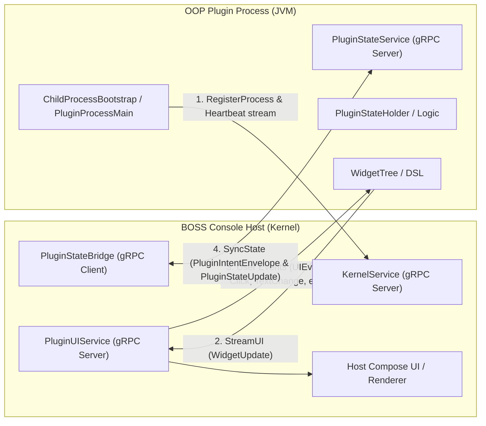
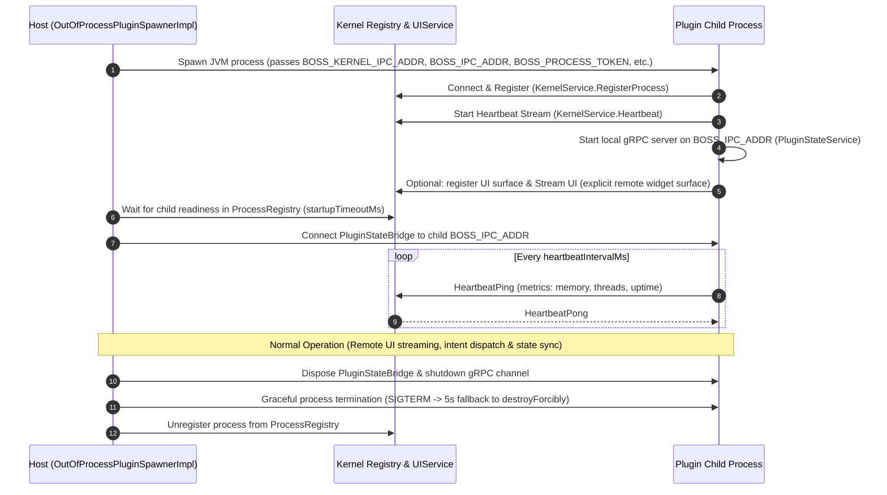

# Out-of-Process (OOP) Plugin & IPC Architecture Guide

This guide documents the architecture, lifecycle, IPC protocols, and step-by-step development workflow for building and running **Out-of-Process (OOP)** plugins within BOSS Console.

> Review status: the build, manifest and standalone-launch recipes below still need an executable integration fixture. The widget example is a local model only, not a complete loadable plugin. Do not treat this draft as a validated step-by-step setup guide.

---

## 1. Overview & Architectural Motivation

BOSS Console supports two execution models for plugins:

| Feature | In-Process Plugins | Out-of-Process (OOP) Plugins |
|---|---|---|
| **Runtime Boundary** | Host JVM (classloader isolation) | Host registration/UI plus child JVM state |
| **Crash Resilience** | Crash / OOM can destabilize host | Child failures are contained; host-side plugin code can still fail |
| **UI Rendering** | Direct Compose Multiplatform composables | Host Compose UI with child state (split-brain), or explicitly registered remote widget surfaces |
| **Classpath Separation** | Potential dependency conflicts with host | Separate child classpath/JVM arguments, plus host-loaded plugin classes |
| **Security / Sandbox** | Shares host memory address space | Separate address space; same OS user, with service-specific IPC checks |

The current `DynamicPluginManager` loads and registers the plugin in the host even on its OOP branch, then starts the child for state management. Declaring OOP therefore does not mean no plugin code executes in the host. Remote widget surfaces are a separate explicit registration path. When no spawner is available, the manager falls back to in-process loading; this is not controlled by any manifest key in the sample below.

### Microkernel Host & IPC Modules
- **`:boss-ipc`**: Core Protocol Buffer definitions (`boss.ipc.v1`), gRPC channel/server abstraction layer (`BossIpcClient`, `BossIpcServer`), child process bootstrapper (`ChildProcessBootstrap`), and process authentication interceptors.
- **`:boss-process-manager`**: Manages process lifecycle (`ProcessSpawner`, `ProcessRegistry`, restart policies, health checks).
- **`:boss-orchestrator`**: Orchestrates service discovery, capability routing, and IPC event dispatching.
- **`:boss-ui-sdk`**: Declarative remote widget tree DSL (`widgetTree`), diff engine (`WidgetDiffEngine`), protobuf converters (`WidgetProtoConverter`), and event mappings (`UIEventMapper`, `WidgetEvent`).
- **`OutOfProcessPluginSpawnerImpl`**: Host-side component responsible for launching, monitoring, handshaking, and tearing down plugin child processes.
- **`PluginUIServiceBridge`**: Kernel-side service implementing `PluginUIService` that receives streamed virtual widget trees and routes Compose user interactions back to child processes.
- **`boss-microkernel-runtime`**: Upstream standalone runtime JAR (separate repository, not a BossConsole Gradle subproject) containing plugin state runners and dispatchers.

---

## 2. IPC Protocol & Communication Model

OOP plugins communicate with the BOSS Console host over local gRPC transport using Protocol Buffers defined in `:boss-ipc` under package `boss.ipc.v1` (Java package `ai.rever.boss.ipc.proto`).



### Core IPC Services (`boss.ipc.v1`)

1. **`KernelService` (`kernel.proto`)** *(Hosted by Kernel)*:
   - Process registration handshake (`RegisterProcessRequest` / `RegisterProcessResponse`). Other processes' service addresses ride in `RegisterProcessResponse.service_addresses`; there is no separate directory-lookup RPC.
   - Liveness heartbeat stream `Heartbeat`: the child sends `HeartbeatPing` (optionally carrying `ProcessHealthMetrics`), and the kernel answers each ping with `HeartbeatPong`.

2. **`PluginUIService` (`ui_protocol.proto`)** *(Hosted by Kernel)*:
   - The plugin process acts as the gRPC **client**, dialing the Kernel's `PluginUIService`.
   - Plugin calls `RegisterUI` with initial `WidgetTree` layout and metadata.
   - Plugin opens bidirectional `StreamUI` call: streams `WidgetUpdate` (a full `WidgetTree` or an incremental `WidgetDiff`) to Kernel, and reads incoming `UIEvent` (clicks, text input, checkbox toggles, keystrokes) streamed from Kernel Compose UI.

3. **`PluginStateService` (`plugin_state.proto`)** *(Hosted by Child Plugin Process)*:
   - Child process runs local `BossIpcServer` on `BOSS_IPC_ADDR`.
   - Host `PluginStateBridge` connects as client.
   - Supports bidirectional `SyncState` (host sends `PluginIntentEnvelope`, child sends `PluginStateUpdate` with snapshots or JSON Merge Patch deltas `PluginStateDelta`).
   - Supports `GetCurrentState` for reconnection recovery.

4. **`EventBusService` (`event_bus.proto`)**:
   - Enables publish-subscribe messaging across plugins and host subsystems.

### Versioning & Compatibility Handshake
The host checks the runtime manifest through `IpcVersion`: incompatible major versions and a minimum newer than the host are rejected. A blank minimum is accepted with a legacy warning; a manifest read failure is logged and currently does not prevent spawning. When spawning a plugin process:
- Host verifies `minIpcVersion` declared by the runtime JAR.
- Incompatible runtime JARs are rejected before process startup to prevent runtime serialization mismatches.

---

## 3. Plugin Lifecycle & Host Interaction



### Lifecycle Stages
1. **Spawn**: `OutOfProcessPluginSpawnerImpl.spawn()` builds the classpath (`runtimeClasspath` + `jarPath` + the resolved API JAR), sets JVM flags (heap bounds, `-Dboss.api.version`), passes environment variables, and launches via `ProcessSpawner`.
2. **Registration Handshake**: `ChildProcessBootstrap` in the child connects to `BOSS_KERNEL_IPC_ADDR` with `BOSS_PROCESS_TOKEN` authentication metadata, registers process ID and IPC listening address via `KernelService.RegisterProcess`.
3. **Readiness Gate**: Host awaits child registration up to `startupTimeoutMs` (default: 30s). If the timeout expires, `cleanupFailedSpawn` forcibly kills the orphaned child. Registration occurs before runtime state-holder initialization, so it is not proof that state sync or UI is usable. The manager launches spawning in the background and logs a failure while the plugin can remain `LOADED`. Current dev scopes process IDs by window and uses the process ID as the state instance ID; plugin identity remains separate.
4. **Heartbeat & Monitoring**: The host config defaults `heartbeatIntervalMs` to 5s. Plugin children are excluded from the global health supervisor, so `RestartPolicy.ON_FAILURE` and `maxRestartAttempts` do not imply automatic plugin restart. See `KernelBootstrap` and the plugin-specific monitoring/recovery path. The standalone runtime currently advertises its own fixed 5s heartbeat and 30s startup contract. The kernel records each ping's timestamp and optional metrics (`GetProcessStatus` / `ListProcesses` expose the last metrics), but no supervision path consults the records - `KernelServiceImpl.isHeartbeatTimedOut` has no callers - so a wedged-but-alive child is invisible to the host until it exits.
5. **UI & State Binding**: A plugin that wants host-rendered remote UI registers its surface on the Kernel `PluginUIService` and starts streaming widgets; the host connects `PluginStateBridge` to the child's `PluginStateService` on `BOSS_IPC_ADDR` for intents and state sync.
6. **Teardown**: Host shuts down state bridge, closes gRPC channels (graceful 3-second wait, then `shutdownNow`), signals child termination (5-second graceful exit before `destroyForcibly`), and unregisters from `ProcessRegistry`.

---

## 4. Building an OOP Plugin (Step-by-Step)

### Step 1: Plugin Manifest (`plugin.json`)

Declare `"isolationMode": "out-of-process"` in your plugin's `plugin.json`:

```json
{
  "manifestVersion": 1,
  "pluginId": "sample-oop-plugin",
  "displayName": "Sample OOP Plugin",
  "version": "1.0.0",
  "apiVersion": "1.0.0",
  "mainClass": "ai.rever.boss.plugin.sample.SamplePlugin",
  "type": "panel",
  "description": "Demonstrates out-of-process plugin capabilities",

  "isolationMode": "out-of-process",

  "sandbox": {
    "maxThreads": 4,
    "maxRestartAttempts": 3,
    "heartbeatIntervalMs": 5000
  },

  "healthContract": {
    "heartbeatIntervalMs": 5000,
    "startupTimeoutMs": 30000
  },

  "panel": {
    "location": "left.top.bottom",
    "icon": "extension",
    "order": 100
  },

  "isDynamic": true,
  "canUnload": true,
  "loadPriority": 100
}
```

Notes on the manifest:

- The host parses `plugin.json` with `ignoreUnknownKeys = true`: unknown keys are silently ignored, not an error.
- There is no `fallback` manifest key: when no spawner is available, `DynamicPluginManager` decides on in-process fallback on its own.
- `stateHolderClass` is not read by the host; the standalone runtime reads it from the plugin manifest and instantiates the child's state holder from it (see the standalone runtime entry under Source references). Declare it only when your state holder satisfies the runtime's state-holder contract.
- `panel` is parsed into the pinned API's `PluginPanelConfig`: `location` (dot-separated `side.slot.position`, e.g. `left.top.bottom`), `icon` (Material icon name), `order`, `panelId` (defaults to `{pluginId}-panel`), and `displayName` (defaults to the plugin's display name). The host's in-repo loader does not use this block to place panels - panels register through `PluginContext.panelRegistry` in the plugin's `register()`. Keys such as `defaultSlot` or `iconName` are ignored.

### Step 2: Build Configuration (`build.gradle.kts`)

OOP plugins are packaged as fat shadow JARs containing the plugin code and its private dependencies, while referencing API and IPC interfaces provided by the host environment:

```kotlin
plugins {
    alias(libs.plugins.kotlinJvm)
    alias(libs.plugins.kotlinSerialization)
    id("com.gradleup.shadow") version "9.1.0"
}

group = "ai.rever.boss.plugin.sample"
version = "1.0.0"

java {
    toolchain {
        languageVersion.set(JavaLanguageVersion.of(17))
    }
}

dependencies {
    // Plugin API and IPC definitions (provided at runtime by host - do not bundle)
    compileOnly(project(":plugin-platform:plugin-api-core"))
    compileOnly(project(":boss-ipc"))
    compileOnly(project(":boss-ui-sdk"))

    // Plugin-specific dependencies
    implementation(libs.kotlinx.coroutines.core)
    implementation(libs.kotlinx.serialization.json)
}

tasks.shadowJar {
    archiveClassifier.set("all")
    mergeServiceFiles()

    manifest {
        attributes["Main-Class"] = "ai.rever.boss.plugin.runtime.PluginProcessMainKt"
    }

}
```

The three `compileOnly` dependencies are never bundled: shadowJar packages the runtime classpath and `compileOnly` is not part of it, so no `exclude(...)` entries are needed. The standalone runtime JAR (where the `Main-Class` lives) is likewise not bundled here - the host adds it to the child classpath at spawn time (see the `BOSS_PLUGIN_RUNTIME_JAR` row in the section 6 table).

> **Note on Gradle Module Paths**: When building inside the BOSS Console repository, microkernel modules live in `modules/` but use flat Gradle project paths: `:boss-ipc` and `:boss-ui-sdk` (not `:modules:boss-ipc`). `boss-microkernel-runtime` is a standalone repository, not a BossConsole Gradle subproject: a complete recipe must resolve a matching runtime and contract artifact for the child classpath (runtime JAR, plugin JAR, then the resolved API JAR) and package the plugin manifest at `META-INF/boss-plugin/plugin.json`. Keep the API version aligned with the host pin in `gradle/libs.versions.toml`; do not substitute an old API JAR. A ready-to-copy variant lives in [`plugin-oop-template/build.gradle.kts.template`](plugin-oop-template/build.gradle.kts.template).

### Step 3: Implementing State & Remote UI (`boss-ui-sdk`)

Out-of-process plugins construct remote UI trees using the declarative `widgetTree` DSL in `boss-ui-sdk`:

```kotlin
package ai.rever.boss.plugin.sample

import ai.rever.boss.ui.sdk.WidgetEvent
import ai.rever.boss.ui.sdk.WidgetTree
import ai.rever.boss.ui.sdk.widgetTree
import kotlinx.coroutines.flow.MutableStateFlow
import kotlinx.coroutines.flow.StateFlow
import kotlinx.coroutines.flow.asStateFlow

class SampleStateHolder {
    private val _counter = MutableStateFlow(0)
    private val _status = MutableStateFlow("Ready")
    val counter: StateFlow<Int> = _counter
    val statusText: StateFlow<String> = _status

    fun increment() {
        _counter.value++
        _status.value = "Incremented"
    }

    fun handleEvent(event: WidgetEvent) {
        when (event) {
            is WidgetEvent.Click -> {
                when (event.eventId) {
                    "btn_increment" -> increment()
                }
            }
            is WidgetEvent.TextChange -> {
                _status.value = event.newValue
            }
            else -> Unit
        }
    }

    fun renderUI(): WidgetTree = widgetTree {
        column {
            text("Counter: ${_counter.value}")
            text("Status: ${_status.value}")
            button(label = "Increment Counter", onClickEvent = "btn_increment")
        }
    }
}
```

The example above is a pure widget-model sketch: it does not satisfy the runtime's state-holder contract, which requires a `CoroutineScope` constructor (optionally also `RemotePluginContext`) and only wires state sync for a `PluginStateHolder` subclass. A complete integration must also supply serialization/intent handling and explicit surface registration.

`WidgetDiffEngine.diff` computes local `DiffOperation` values; it does not transmit them. Plugin code must register a surface through the runtime client, convert the tree or diff to protobuf, send updates, collect UI events, and dispose the surface. `PluginUIService` is served by the host; the child calls `RegisterUI` and then `StreamUI`, sending `WidgetUpdate` values and receiving `UIEvent` values on that stream. Reconnection requires registration again. Key events additionally require the surface registration to opt into `wants_keys`.

---

## 5. Security & Permission Boundaries

1. **Process Isolation**: A separate JVM contains many child failures, but is not an operating-system security sandbox. It runs as the same OS user and can access resources permitted to that user; resource exhaustion can still affect the host.
2. **IPC Identity and Authorization**: Kernel calls can carry a verified process identity via `ProcessIdentityInterceptor`. Remote UI checks ownership against that identity. This is not a blanket RBAC guarantee for every service: inspect the individual service bridge and provider before relying on an authorization boundary. Child-side servers do not automatically inherit the kernel interceptor.
3. **Environment Inheritance**: `ProcessSpawner` starts with the inherited `ProcessBuilder` environment and adds process addresses, identity, and a minted `BOSS_PROCESS_TOKEN`, plus plugin/window/project values. It does not clear or allowlist the parent environment. Never assume secrets in the host environment are hidden from a child.

---

## 6. Debugging & Local Testing

### Required Launch Parameters & Environment Variables

When running or debugging an OOP plugin process (either spawned by host or executed independently):

| Variable / Parameter | Type | Description |
|---|---|---|
| `BOSS_PROCESS_ID` | Env Var | Unique identifier for the process (e.g. `plugin-sample-oop-plugin`) |
| `BOSS_PROCESS_TYPE` | Env Var | Process type enum (`PLUGIN` or `SERVICE`) |
| `BOSS_KERNEL_IPC_ADDR` | Env Var | Host kernel gRPC listening address (e.g. `localhost:50051` or domain socket) |
| `BOSS_IPC_ADDR` | Env Var | Child process's own gRPC server bind address (e.g. `localhost:50052`) |
| `BOSS_PLUGIN_CLASSPATH` | Env Var | Path to the plugin's fat shadow JAR |
| `BOSS_PROCESS_TOKEN` | Env Var | IPC security token minted by the host kernel (required for authenticated remote UI) |
| `BOSS_PLUGIN_ID` | Env Var | Plugin identity set by the spawner; the host recovers the plugin ID from process metadata via this variable |
| `BOSS_PROJECT_PATH` | Env Var | Active project root directory |
| `BOSS_WINDOW_ID` | Env Var | ID of the host window hosting the panel/tab |
| `BOSS_PLUGIN_RUNTIME_JAR` | Env Var (host-side) | Path to the standalone `boss-microkernel-runtime` JAR the host prepends to the child classpath; a default location is probed when unset |
| `-Dboss.api.version` | JVM Arg | Target API version (e.g. `-Dboss.api.version=1.0.0`) |
| `-Xmx512m -Xms64m` | JVM Arg | Process heap allocation bounds |

### Standalone Process Execution Example

The command below is a sketch, not a validated standalone recipe: `ChildProcessBootstrap` additionally requires process identity and a child address (or the process type from which to resolve it), and authenticated remote UI needs a host-minted `BOSS_PROCESS_TOKEN`. A future fixture should supply these through a test host; do not copy or log credentials from a running host. Classpath separators are `:` on macOS/Linux and `;` on Windows.

```bash
# Set required environment variables
export BOSS_PROCESS_ID="plugin-sample-oop-plugin"
export BOSS_PROCESS_TYPE="PLUGIN"
export BOSS_KERNEL_IPC_ADDR="localhost:50051"
export BOSS_IPC_ADDR="localhost:50052"
export BOSS_PLUGIN_CLASSPATH="/path/to/sample-oop-plugin-all.jar"

# Launch JVM with JDWP debugging enabled
java -agentlib:jdwp=transport=dt_socket,server=y,suspend=n,address=5005 \
     -Dboss.api.version=1.0.0 \
     -Xms64m -Xmx512m \
     -cp "boss-microkernel-runtime-all.jar:sample-oop-plugin-all.jar" \
     ai.rever.boss.plugin.runtime.PluginProcessMainKt
```

### Unit Testing Remote Widgets & Diff Engine

Use `WidgetDiffEngine` directly in unit tests to assert UI tree generation and diff delta calculations without spinning up a gRPC server:

```kotlin
import ai.rever.boss.ui.sdk.DiffOperation
import ai.rever.boss.ui.sdk.WidgetDiffEngine
import ai.rever.boss.ui.sdk.WidgetType
import kotlin.test.Test
import kotlin.test.assertEquals
import kotlin.test.assertTrue

class SampleStateHolderTest {
    @Test
    fun testWidgetTreeGenerationAndDiff() {
        val stateHolder = SampleStateHolder()
        val initialTree = stateHolder.renderUI()

        // column + 2 text nodes + button = 4 total
        assertEquals(4, initialTree.nodes.size)
        val root = initialTree.nodes[initialTree.rootId]!!
        assertEquals(WidgetType.COLUMN, root.type)

        // Trigger action via WidgetEvent
        stateHolder.handleEvent(WidgetEvent.Click(eventId = "btn_increment"))
        val updatedTree = stateHolder.renderUI()

        // Calculate diff operations
        val diffOps = WidgetDiffEngine.diff(old = initialTree, new = updatedTree)
        assertTrue(diffOps.isNotEmpty(), "Diff should contain property updates for changed text")

        val hasUpdatedNode = diffOps.any { it is DiffOperation.NodeUpdated }
        assertTrue(hasUpdatedNode, "Expected NodeUpdated operation for counter text change")
    }
}
```

## Source references

- [Host OOP load path](../composeApp/src/commonMain/kotlin/ai/rever/boss/components/plugin/DynamicPluginManager.kt)
- [Child spawner and readiness](../composeApp/src/desktopMain/kotlin/ai/rever/boss/components/plugin/OutOfProcessPluginSpawnerImpl.kt)
- [Process supervision](../modules/boss-process-manager/src/main/kotlin/ai/rever/boss/process/ProcessMonitor.kt)
- [UI wire contract](../modules/boss-ipc/src/main/proto/boss/ipc/v1/ui_protocol.proto)
- [Identity interceptor](../modules/boss-ipc/src/main/kotlin/ai/rever/boss/ipc/auth/ProcessIdentityInterceptor.kt)
- [SDK builder](../modules/boss-ui-sdk/src/main/kotlin/ai/rever/boss/ui/sdk/WidgetTreeBuilder.kt) and [diff engine](../modules/boss-ui-sdk/src/main/kotlin/ai/rever/boss/ui/sdk/WidgetDiffEngine.kt)
- [Standalone runtime entry point, reviewed revision](https://github.com/risa-labs-inc/boss-microkernel-runtime/blob/7ac0607ee7884b04a4b225bbdc3cf732c83cb30f/src/main/kotlin/ai/rever/boss/plugin/runtime/PluginProcessMain.kt)
